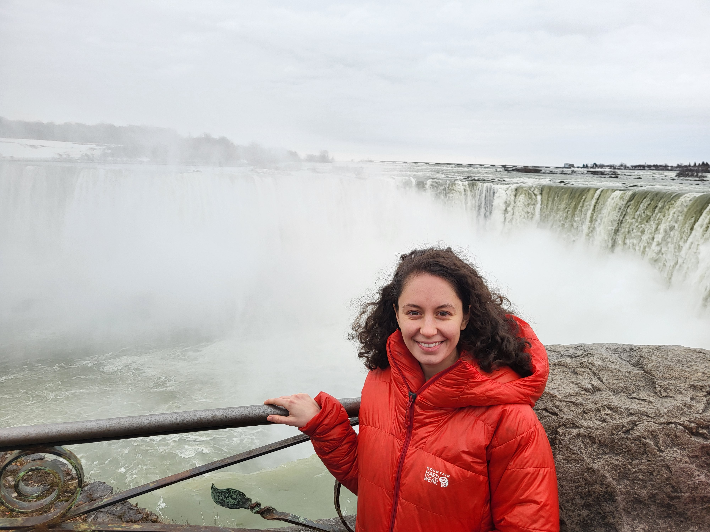

---
title:
subtitle: 
description:
featured_image: /images/about_image.jpg
---

Andrea is a PhD candidate whose research integrates analytical science, solid mechanics, and environmental chemistry to investigate microplastics, which pose a serious and growing threat to the health of our planet. Through her studies in mechanical and biomedical engineering, Andrea also possesses background knowledge in fluid mechanics, heat and mass transfer, and biology.

She is passionate about applying her skills to find sustainable solutions to the world’s biggest challenges, and is seeking a job that will give her opportunities to grow as a critical thinker, expand her data science skills, and contribute to the health of people and planet.
